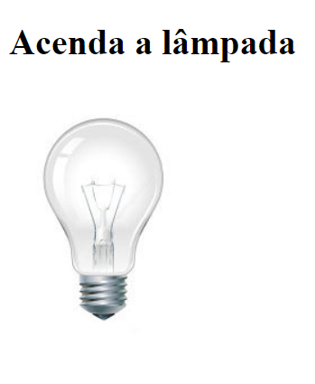
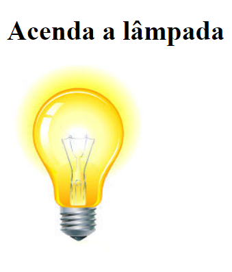

# LAMPADA
👨‍🏫PROJETO FEITO PARA O CURSO DE HTML E CSS DO CURSO EM VIDEO.

   
   
  

## DESCRIÇÃO:
O projeto "Lâmpada" apresenta uma lâmpada interativa que pode ser controlada pelo usuário. Aqui estão os recursos principais do projeto:

- **Controle da Lâmpada:**
  - Ao passar o mouse sobre a lâmpada, ela acende.
  - Ao retirar o mouse, a lâmpada apaga.
  - Ao clicar na lâmpada, ela quebra, indicando que está quebrada e não pode mais ser acesa.

## EXECUTANDO O PROJETO:
1. Abra o arquivo `CODIGO.html` em um navegador da web.
2. Passe o mouse sobre a lâmpada para acendê-la.
3. Retire o mouse da lâmpada para apagá-la.
4. Clique na lâmpada para simular sua quebra.

## NÃO SABE?
- Entendemos que para manipular arquivos em `HTML`, `CSS` e outras linguagens relacionadas, é necessário possuir conhecimento nessas áreas. Para auxiliar nesse aprendizado, oferecemos cursos gratuitos disponíveis:
* [CURSO DE HTML E CSS](https://github.com/VILHALVA/CURSO-DE-HTML-E-CSS)
* [CURSO DE JAVASCRIPT](https://github.com/VILHALVA/CURSO-DE-JAVASCRIPT)
* [CONFIRA MAIS CURSOS](https://github.com/VILHALVA?tab=repositories&q=+topic:CURSO)

## CREDITOS:
- [PROJETO FEITO PELO VILHALVA](https://github.com/VILHALVA)
- [PROJETO FEITO PARA O CURSO DE HTML E CSS](https://github.com/VILHALVA/CURSO-DE-HTML-E-CSS)
